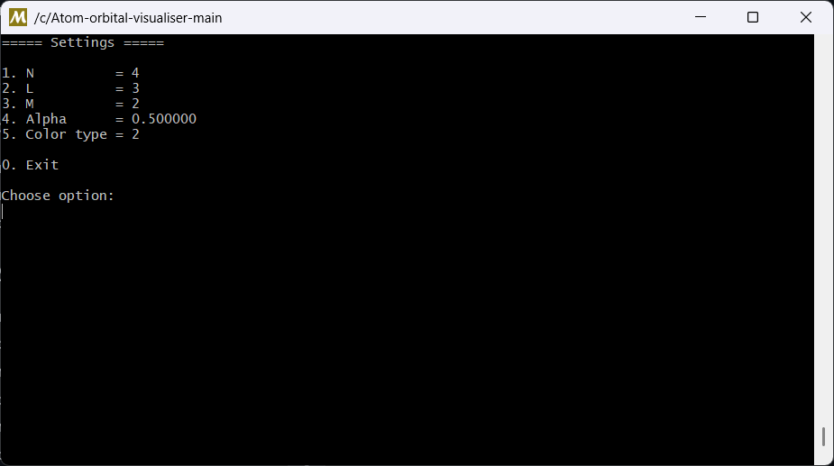

Atom Orbital Visualiser

A 3D atom orbital visualiser written in C using OpenGL, GLFW and GLAD.

Features

* Interactive 3D visualization of atomic orbitals
* Adjustable quantum numbers (n, l, m)
* Mouse-controlled camera rotation
* Transparency adjustment
* Multiple orbital coloring modes
* Real-time rendering

Controls

* Left Mouse Button + Drag — Rotate the camera
* R — Open the settings menu (in console)
* N, L, M — Change quantum numbers
* Alpha — Adjust orbital transparency
* Color Type — Switch between coloring modes

Requirements

* C compiler (GCC or Clang)
* OpenGL
* GLFW
* GLAD

## Screenshots

### Menu


### 1s Orbital (N=3, L=0, M=0)


### 2p Orbital (N=3, L=1, M=0)


### 3d Orbital (N=5, L=2, M=0)


### 5f Orbital (N=5, L=4, M=0)


Build

```bash
gcc main.c window.c shader.c mesh.c renderer.c orbital.c glad/src/gl.c \
-Iglad/include -o main -L. -lglfw3 -lopengl32 -lgdi32
```
Run

```bash
./main
```
License

This project is available for educational purposes.
