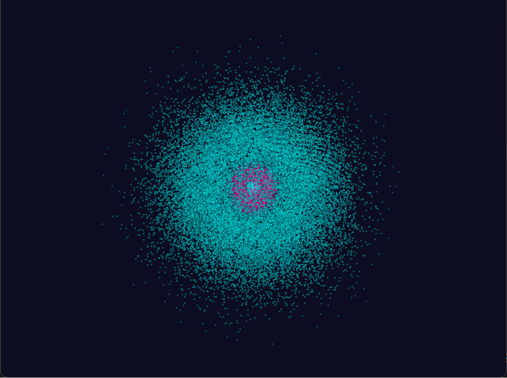
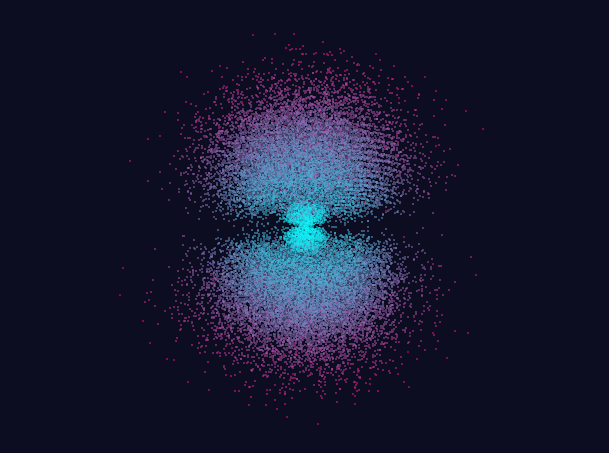
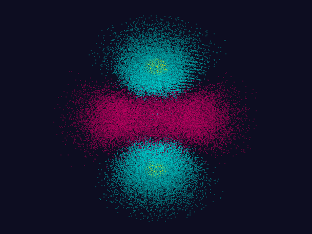
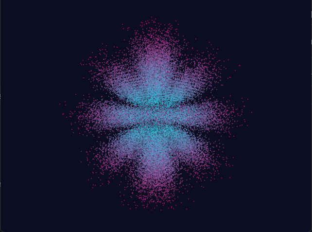

# Atom Orbital Visualiser

A 3D atom orbital visualiser written in C using OpenGL, GLFW and GLAD.

## Features

* Interactive 3D visualization of atomic orbitals
* Adjustable quantum numbers (n, l, m)
* Mouse-controlled camera rotation
* Transparency adjustment
* Multiple orbital coloring modes
* Real-time rendering

## Controls

* Left Mouse Button + Drag — Rotate the camera
* R - Open the settings menu (in console)
* N, L, M - Change quantum numbers
* Alpha - Adjust orbital transparency
* Color Type - Switch between coloring modes

## Requirements

* C compiler (GCC or Clang)
* OpenGL
* GLFW
* GLAD

## Build

### Linux
```bash
gcc main.c window.c shader.c mesh.c renderer.c orbital.c glad/src/gl.c \
-Iglad/include -o main -lglfw3 -lGL -lm
```

### macOS
```bash
gcc main.c window.c shader.c mesh.c renderer.c orbital.c glad/src/gl.c \
-Iglad/include -o main -lglfw3 -lGL -lm
```

### Windows (MinGW)
```bash
gcc main.c window.c shader.c mesh.c renderer.c orbital.c glad/src/gl.c \
-Iglad/include -o main.exe -L. -lglfw3 -lopengl32 -lgdi32
```

### Windows (Visual Studio)
```bash
cl main.c window.c shader.c mesh.c renderer.c orbital.c glad/src/gl.c \
/I glad/include /link glfw3.lib opengl32.lib user32.lib
```

## Run

### Linux/macOS
```bash
./main
```

### Windows
```bash
main.exe
```

## Screenshots

### Orbitals

| 1s Orbital (N=3, L=0, M=0) | 2p Orbital (N=3, L=1, M=0) |
|---|---|
|  |  |

| 3d Orbital (N=5, L=2, M=0) | 5f Orbital (N=5, L=4, M=0) |
|---|---|
|  |  |

## License

MIT License - see [LICENSE](LICENSE) file for details
